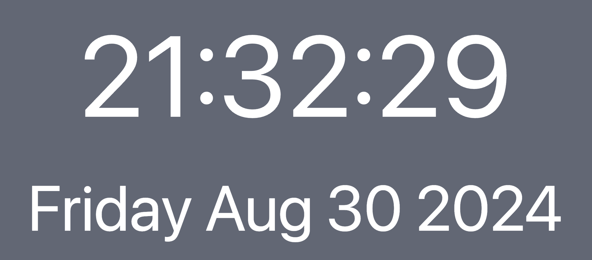

# [Clock App](https://dom1153.github.io/clockApp/)



A fullscreen real time clock with customizable display settings.

See the website live at [https://dom1153.github.io/clockApp](https://dom1153.github.io/clockApp/)

## Features

1. Real time clock and date display.
2. Customizable UI to change display time formats.
3. Setting to display a wallpaper from Pexel images.
4. Responsive web design.
5. Fullscreen window mode.

### Technologies

- React
- Tailwind CSS
- Pexel Image API
- Page deployment via github pages

## Running Locally

```bash
npm install
npm run dev
# or use yarn / pnpm / bun equivalents
```

## Inspiration

This was a code study to reproduce an app similar to https://clockie.app/

Having no real prior react experience I wanted to see how simple it was to create an app from scratch.